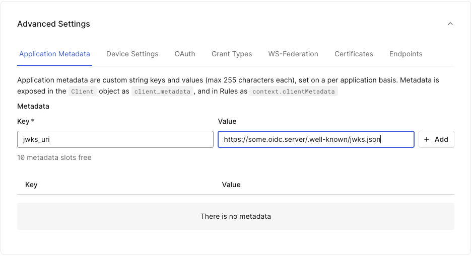

# Lambda JWK Manager

## Overview

This project contains a Lambda function that interacts with Auth0, fetches JSON Web Keys (JWKs)
from URIs configured in Auth0 client metadata, and generates credentials for each client in your
Auth0 account. The function is designed to be easy to configure and deploy using the Serverless Framework.

This is used as a workaround to support remote JWKS URI key material when using the private key JWT client
authentication method in Auth0.

Here is a diagram of what this lambda does:


Using expiresAt, this Lambda can be run as frequently as necessary. The Lambda
code checks the cached ket set data and only fetches a new key set and updates
Auth0 client credentials when a new key set is downloaded for the first time,
or if the cached key set has expired.

## Onboarding New Auth0 Applications

Each new OIDC client to be onboarded needs to define an application
metadata key/value pair to indicate from where the key material should be
gathered. Any OIDC client without the metadata value “jwks_uri” would be
skipped.



With this approach one can simply onboard new OIDC clients that require JWKS
URI by creating this key/value pair. No extra action is needed as the lambda
function will automatically discover the JWKS_URI for that client.

## Caveats

- Only one public key can be active at a time for client authentication
- The lambda uses the first key in the set for client authentication
- Key sets with multiple keys are not supported

## Prerequisites

Before you can deploy and use this project, make sure you have the following:

1. **Node.js** and **npm** installed. You can check if Node.js is installed by running:

   ```bash
   node -v
   ```

If it’s not installed, you can download it from [here](https://nodejs.org/).

2. **Serverless Framework** installed globally. You can install it by running:

   ```bash
   npm install -g serverless
   ```

3. **AWS CLI** configured with access to your AWS account. You can configure it by running:

   ```bash
   aws configure
   ```

4. **AWS Secrets Manager** permissions set up to store sensitive values such as `AUTH0_CLIENT_SECRET`.

## Setup

1.  Create an Auth0 Application

    Create a new Auth0 Machine to Machine application.

    Authorize this new application to use the Auth0 management API with the
    following scopes enabled:

    - `create:client_credentials`
    - `update:clients`
    - `read:clients`

    Make note of the Domain, Client ID and Client Secret values from the Settings tab.

2.  Clone the Repository

    Clone the repository and navigate to the project directory:

    ```bash
    git clone https://github.com/mdwallick/lambda-jwk-manager.git
    cd lambda-jwk-manager
    ```

3.  Install Dependencies

    Install the required npm dependencies:

    ```bash
    npm install
    ```

4.  Create AWS Secret for `AUTH0_CLIENT_SECRET`

    You need to create a secret in AWS Secrets Manager to securely store the `AUTH0_CLIENT_SECRET`.

    This secret will be accessed by the Lambda function at runtime.

    Create your secret using the AWS CLI. Replace region with your region name.

    ```bash
    aws secretsmanager create-secret \
      --name jwk-manager-client-secret \
      --description "Auth0 Client Secret for jwk-manager Lambda" \
      --secret-string '{"AUTH0_CLIENT_SECRET":"your client secret"}' \
      --region us-east-1
    ```

    You can verify the secret was created with this command:

    ```bash
    aws secretsmanager get-secret-value \
      --secret-id jwk-manager-client-secret \
      --region us-east-1
    ```

5.  Configure `.env` File

    In the project directory, copy `.env.example` to `.env` file and fill in the following environment variables:

    ```ini
    AUTH0_DOMAIN=your-auth0-domain
    AUTH0_CLIENT_ID=your-client-id
    AUTH0_CLIENT_SECRET_NAME=jwk-manager-client-secret
    JWK_METADATA_KEY=jwks_uri_DO_NOT_DELETE
    EXPIRY_METADATA_KEY=expires_at_DO_NOT_DELETE
    ```

6.  Deploy the Service

    Deploy the service to AWS using the Serverless Framework:

    ```bash
    serverless deploy --region us-east-1
    ```

    This will:

    - Create the necessary IAM roles for your Lambda function.
    - Deploy the Lambda function to AWS.
    - Set up API Gateway and other resources.
    - Access the secret from AWS Secrets Manager during runtime.

    After deployment, you will receive an API Gateway URL where you can test the deployed service.

## Using the Service

Once the service is deployed, it will expose an HTTP endpoint. You can call this endpoint with a POST request to trigger the Lambda function.

### Test Locally with `serverless-offline`

If you want to test the Lambda function locally, you can use the `serverless-offline plugin`, which simulates AWS API Gateway locally.

1. Install the `serverless-offline` plugin:

   ```bash
   npm install --save-dev serverless-offline
   ```

2. Add the plugin to `serverless.yml`:

   ```yaml
   plugins:
     - serverless-dotenv-plugin
     - serverless-offline
   ```

3. Run the function locally:

   ```bash
   serverless offline start
   ```

   The function will be available at `http://localhost:3000/jwk-manager`.

## Automating Secret Creation and Deployment

To simplify the setup, you can create the secret in AWS Secrets Manager and deploy the service using a deployment script. Follow the steps below to automate the process:

### `deploy.sh` Script

Create a `deploy.sh` script to automate the setup and deployment process:

```bash
#!/bin/bash

# Ensure AWS CLI is configured

aws configure

# Create the secret in Secrets Manager if it doesn't exist

aws secretsmanager create-secret --name jwk-manager-client-secret --secret-string '{"AUTH0_CLIENT_SECRET": "your-secret-value"}' || echo "Secret already exists."

# Install dependencies

npm install

# Deploy with Serverless

serverless deploy
```

Run the script to automate secret creation and deployment:

```bash
./deploy.sh
```

## Troubleshooting

### Common Errors

- **Unauthorized (Access Denied)**: If you see this error, ensure that your Lambda function has the appropriate IAM permissions to access the AWS Secrets Manager secret.
- **Invalid Auth0 Domain or Client ID**: Double-check that your `AUTH0_DOMAIN` and `AUTH0_CLIENT_ID` are correctly set in your `.env` file or environment variables.

If you encounter any issues or need help, feel free to reach out via GitHub Issues or contact the maintainers.

## Contributing

Feel free to open issues and pull requests if you have suggestions for improvements or fixes.

## License

This project is licensed under the MIT License - see the [LICENSE](./LICENSE) file for details.
